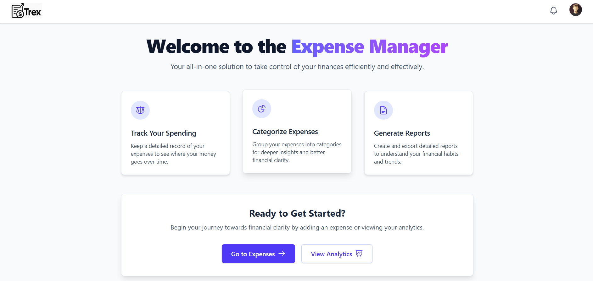
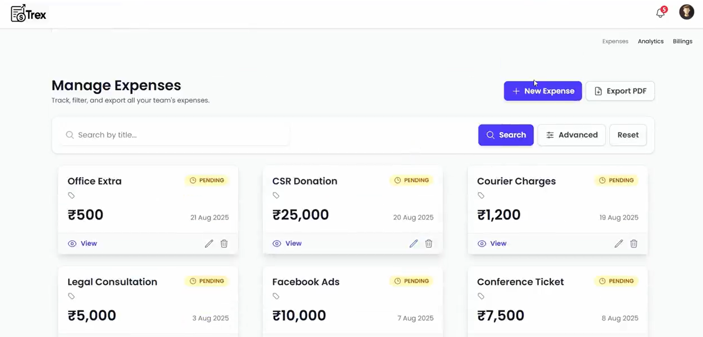
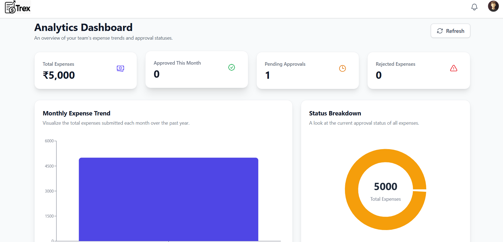
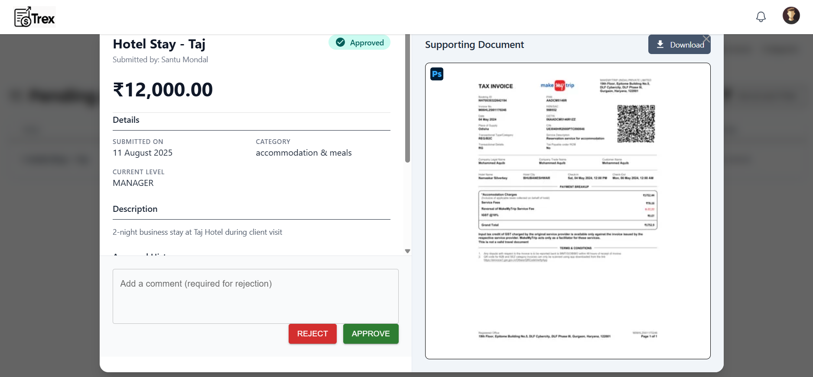

# 💰 Expense Management System

A modern, feature-rich expense management application built with React and Vite. This application provides comprehensive expense tracking, approval workflows, analytics, and user management capabilities designed for teams and organizations.

[](https://react.dev/)
[](https://vitejs.dev/)
[](LICENSE)

## 📸 Screenshots

| Main Dashboard | Expense Management | Analytics | Approval Workflow |
|:---:|:---:|:---:|:---:|
|  |  |  |  |


## ✨ Features

- **🔐 Authentication & Authorization**
  - User registration and secure login
  - Password reset and recovery
  - Role-based access control
  - User profile management

- **💸 Expense Management**
  - Create, read, update, and delete expenses
  - Advanced filtering and search capabilities
  - Multiple expense categories
  - Real-time status tracking
  - Bulk operations support

- **✅ Approval Workflow**
  - Multi-level expense approval process
  - Approval dashboard for managers
  - View detailed approval history
  - Advanced filtering options

- **📊 Analytics & Reporting**
  - Interactive analytics dashboard
  - Expense insights and trends
  - Visual data representation
  - Category-wise analysis

- **📄 Invoice Management**
  - Generate and view invoices
  - User invoice dashboard
  - Professional invoice templates

- **👥 User Management**
  - Comprehensive user dashboard
  - User filtering and search
  - User profile management
  - Activity tracking

- **📋 Audit & Compliance**
  - Complete audit log tracking
  - Filter audit logs by various criteria
  - View detailed audit event history
  - Compliance reporting

- **🔔 Notifications**
  - Real-time notification system
  - Notification dropdown
  - Email notifications for important events

## 🛠️ Tech Stack

- **Frontend Framework**: React 18.x
- **Build Tool**: Vite 5.x
- **Styling**: CSS with Tailwind/PostCSS support
- **State Management**: Context API
- **HTTP Client**: Axios (via custom API service)
- **Development Tools**: ESLint for code quality

## 📋 Prerequisites

Before you start, ensure you have the following installed:

- **Node.js**: v16.0.0 or higher
- **npm** or **yarn**: Latest stable version
- **Git**: For version control

## 🚀 Getting Started

### 1. Clone the Repository

```bash
git clone https://github.com/sagarboyal/enterprise-expense-tracker-ui.git
cd enterprise-expense-tracker-ui
```

### 2. Install Dependencies

```bash
npm install
# or
yarn install
```

### 3. Configure Environment Variables

Create a `.env.local` file in the root directory:

```env
VITE_API_BASE_URL=http://localhost:5000/api
VITE_APP_NAME=Expense Management System
```

Refer to `.env.example` for all available configuration options.

### 4. Start Development Server

```bash
npm run dev
# or
yarn dev
```

The application will be available at `http://localhost:5173`

## 📁 Project Structure

```
src/
├── components/               # React components organized by feature
│   ├── analytics/           # Analytics dashboard
│   ├── approval/            # Approval workflow components
│   ├── audit-log/           # Audit logging UI
│   ├── auth/                # Authentication components
│   ├── categories/          # Category management
│   ├── common/              # Shared/common components
│   ├── contactrequest/      # Contact request handling
│   ├── expenses/            # Expense management components
│   ├── invoice/             # Invoice management
│   ├── users/               # User management
│   └── utils/               # Utility UI components
├── services/                # API services and business logic
│   └── api.js              # Centralized API calls
├── store/                   # State management
│   └── ContextApi.jsx      # Context for global state
├── assets/                  # Images, fonts, and static files
├── App.jsx                  # Root component
├── main.jsx                 # Application entry point
└── index.css               # Global styles
```

## 🎯 Key Components

| Component                   | Purpose                         |
| --------------------------- | ------------------------------- |
| **HomePage**                | Landing page and main dashboard |
| **Expenses**                | Expense listing and management  |
| **ApprovalPanel**           | Expense approval interface      |
| **AnalyticsDashboard**      | Data visualization and insights |
| **UserManagementDashboard** | User administration             |
| **AuditLog**                | System activity logging         |
| **InvoiceDashboard**        | Invoice generation and tracking |

## 🔧 Available Scripts

```bash
# Start development server with HMR
npm run dev

# Build for production
npm run build

# Preview production build locally
npm run preview

# Run ESLint checks
npm run lint

# Fix ESLint issues automatically
npm run lint --fix
```

## 📝 Environment Configuration

Create a `.env.local` file to customize your environment:

```env
# API Configuration
VITE_API_BASE_URL=http://localhost:5000/api

# App Configuration
VITE_APP_NAME=Expense Management System
VITE_APP_VERSION=1.0.0
```

## 🏗️ Building for Production

```bash
npm run build
```

The optimized production build will be generated in the `dist/` directory.

To preview the production build locally:

```bash
npm run preview
```

## 🧪 Testing & Quality

The project uses ESLint for code quality assurance. Run checks with:

```bash
npm run lint
```

## 🔑 Key Features Explained

### Authentication Flow

- Users can sign up or log in
- Passwords are securely handled
- Session management via Context API
- Protected routes for authenticated users

### Expense Workflow

1. User creates an expense
2. Expense is submitted for approval
3. Manager approves/rejects the expense
4. User receives notification
5. Approved expenses appear in reports

### Approval Process

- Multi-level approval hierarchy
- Advanced filtering by status, date, amount
- Bulk approval operations
- Approval history and audit trail

### Analytics

- Real-time dashboard with key metrics
- Category-wise expense breakdown
- Trend analysis
- Export reports

## 🤝 Contributing

Contributions are welcome! Here's how to contribute:

1. Fork the repository
2. Create a feature branch (`git checkout -b feature/AmazingFeature`)
3. Commit your changes (`git commit -m 'Add some AmazingFeature'`)
4. Push to the branch (`git push origin feature/AmazingFeature`)
5. Open a Pull Request

Please ensure your code follows the ESLint rules and maintains the project's code style.

## 📞 Support & Contact

- 📧 **Email**: sagarboyal.024@gmail.com
- 🐛 **Report Issues**: [GitHub Issues](https://github.com/sagarboyal/enterprise-expense-tracker-ui/issues)
- 💡 **Suggestions**: Feel free to open a discussion

## 📄 License

This project is licensed under the MIT License - see the [LICENSE](LICENSE) file for details.

## 🙏 Acknowledgments

- [React Documentation](https://react.dev/)
- [Vite Documentation](https://vitejs.dev/)
- [Axios](https://axios-http.com/)
- Community contributors and supporters

---

**Built with ❤️ by Sagar Boyal**

Star ⭐ this repository if you find it helpful!
